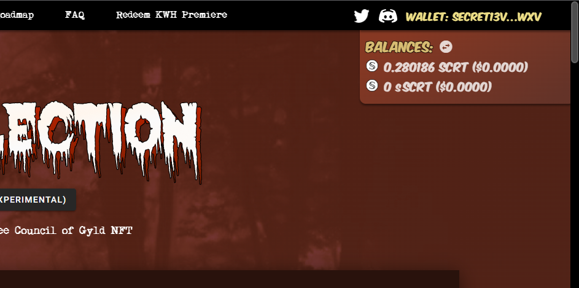
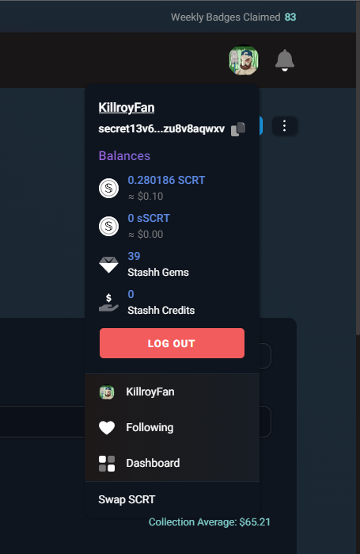
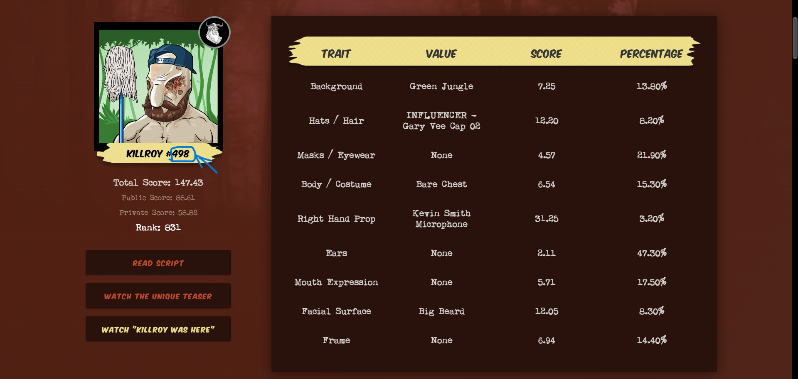
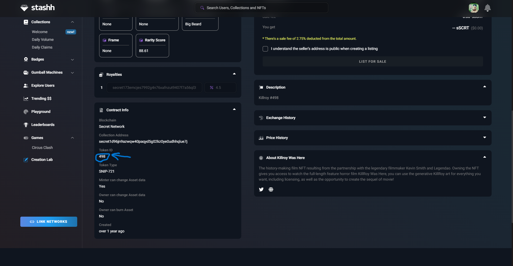
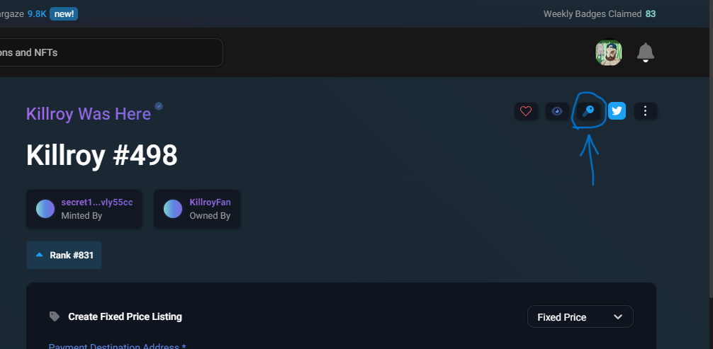
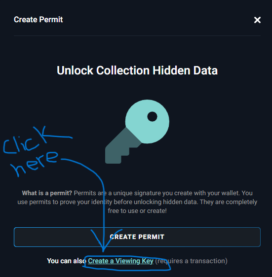
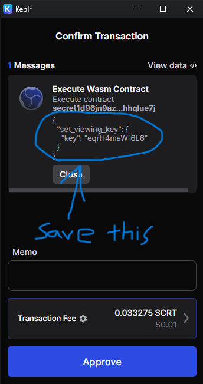

# killroy-was-here-downloader
Used to download your copy of the film Killroy Was Here using your KWH NFT private metadata.

REQUIREMENTS:
- node
- npm
- 7zip, winrar, or other archive extraction software (for unzipping full movie download)
- ffmpeg (for teaser download only)

This script is designed to make the download of your Killroy Was Here nft private data easier. Providing a simple download solution for the full film and unique teaser.

## Prerequisites:

- Your personal wallet address (containing your Killroy nft)
- Your Killroy token id (numeric value of your Killroy nft)
- Your Killroy token viewing key (created at the time of purchase, easily recreated to run this script if you don't have the current one.)


### The personal wallet address is the wallet that contains your nft not the collection address.

On killroywashere.io you can view the wallet address clicking here.

 

On stashh.io you can view the wallet address by clicking on your profile and clicking the wallet address here.

 


### The token id is the number of your killroy

On killroywashere.io in 'My Collection' you can view the token id here.

 

On stashh.io you can view the token id here.

 

### The viewing key can easily be made on stashh.io, open your token on stashh.io and click the key on the top right corner and create viewing key.

On stashh.io you can create a viewing key for your token.
1. click on the key

 

2. use create viewing key option

 

3. make sure to save your newly created viewing key somewhere you won't lose it before clicking approve.

 

## Install instructions:

First clone this repo into a place that can handle at least a greater than 7gb download.

```
# first go into the cloned folder
cd killroy-was-here-downloader

# install dependencies
npm install
```

## Running the script

```
# run the script with node
node killroy_was_here_downloader.mjs
```
You'll first be asked for your wallet address, simply copy paste from your wallet.

Second you'll be asked for your token id, this only expects the number (eg. '265')

Third you'll be aked to provide your viewing key for the token.

With the information the secretjs package will reach out for the private metadata to your token and retreive the information need to download the movie.

The movie download will take a while, once complete it will save a txt file in the same folder named password.txt. The file will contain the password required to extract the movie file.

Once the movie download completes you'll be asked if you would like to download your unique teaser in the nft. If you select yes an ffmpeg command will be ran so you much have ffmpeg installed before running this script. If you only want to download your teaser answer 'n' when asked "Do you want to download the full movie? (yes/no):".

UPDATES AND PICTURE TUTORIAL TO COME.
